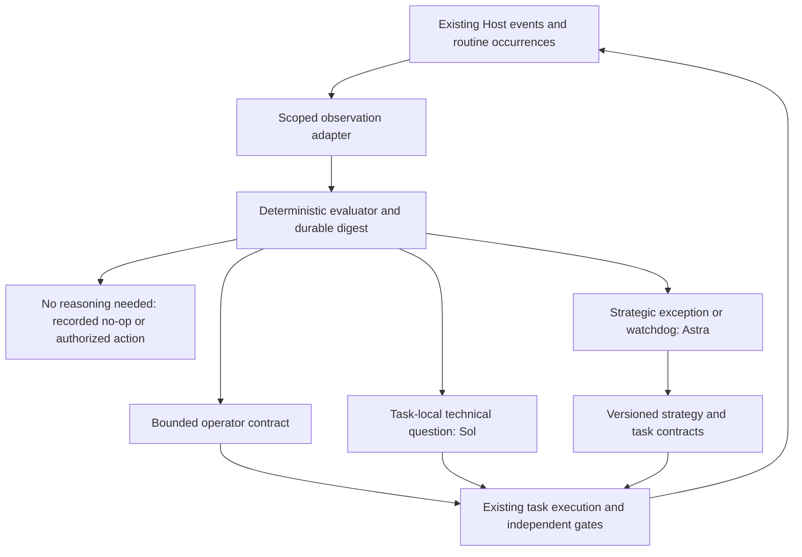

# Cost-optimized Coordinator: assessment and incremental rollout

**Architecture superseded, 2026-09-20:** the Human now requires Astra as the
stable PRIMARY, Terra/Luna for bounded execution and Sol only when a substantial
technical investigation benefits from offloading. The inexpensive-primary
recommendation and cutover target below are historical. The current binding
design is [COORDINATOR_OPERATING_STRATEGY.md](../COORDINATOR_OPERATING_STRATEGY.md).
Preserve the pilot's outstanding correctness, independent review and shadow-only
gates; this policy change does not accept its implementation or authorize live
wake suppression. Measure whole-team cost per verified outcome under the new
architecture before claiming optimization. No primary downgrade is scheduled.

Assessment date: 2026-09-19. Status: implementation authorized; shadow pilot
assigned; live cutover not verified. This is an extension of
[PLUGIN_SCALE_RFC.md](PLUGIN_SCALE_RFC.md), not a second orchestration system.

Initial delivery is [draft plugin PR #5](https://github.com/yattdev/kandev-plugin-coordinator/pull/5).
Independent Review rejected `cc6158785387a27f610816cd412760403f15d6cf`:
contract updates were not atomic, observations could discard unreviewed changes,
and routing, runtime configuration and validation coverage were incomplete.
Focused passing tests do not override that verdict. Repairs must return through
fresh independent Review and QA; shadow mode remains the only authorized pilot
behavior. Delivery progress and owners live in the task plan.

## Recommendation

**Primary target, reaffirmed by the Human:** this permanent board Coordinator
task must adopt the optimization. Plugin work supplies reusable components;
plugin delivery alone does not complete the request. Acceptance includes lower
context consumption on this task's real wakes, a verified inexpensive operational
primary, bounded Sol/Astra helpers, preserved board progress and rollback.

Current tools allow requesting a profile when spawning a sibling session, but
do not expose a verified atomic primary/routine-target handoff. A workflow can
override a requested profile. Therefore distinguish requested model, actual
runtime model, primary ownership and routine routing. Reuse the existing
Coordinator rotation/queue capability owners before introducing another path.
After the implementation and board trial pass, perform the supported transition
to the proposed Terra primary and prove all four identities; until then the
current primary stays authoritative. Do not count an unchanged Astra primary
plus a new plugin library as realized savings.

**Human clarification, 2026-09-19:** keep Kandev Automation sending periodic
wake messages. Put the gate **after wake receipt, inside the Coordinator**.
The intended operational primary is Terra; bounded technical exceptions ask
Sol, and board-wide strategic exceptions ask Astra, as short-lived subagents.
Both receive a compact explicit input rather than inherited full history.
The operational primary retains the single mutation lane and persists results.
The current primary has not been switched by this rollout; an Astra primary
still incurs Astra wake cost. The inspected Host pipelines below are reuse
evidence, not a request to replace Kandev's working wake delivery.

```text
Kandev Automation → periodic wake → operational Coordinator + gate
                                    ├─ bounded routine action
                                    ├─ Sol technical helper
                                    └─ Astra strategic helper
                                          ↓
                               durable decision → Coordinator action
```

The watchdog checks elapsed time on an arriving wake. It cannot wake a model
itself, and needs no new timer/cron/scheduler. Its actual latency is the chosen
strategic interval plus at most the external wake cadence under healthy delivery.

Keep Astra responsible for board strategy. First measure real dispatches and
run a deterministic digest/router alongside existing monitoring. Then use
that evaluator after the incoming automation wake to select bounded helper
work using supported model-selection capabilities. Do not introduce another
scheduler, queue, database engine, or extra permanent operator. Use task-scoped model work only when code cannot
safely decide the bounded next action.

The largest potential saving is avoiding unnecessary **recipient** inference
and repeated historical context. Removing a model used merely to deliver a
wake is useful, but that wake still causes its Coordinator recipient to run.
Compact prompt text also does not, by itself, remove a managed conversation's
history. Both boundaries must be measured separately.

## Evidence and scope

Inspected plugin source at `6fb1fdd63c1728258c40a67df037116c5ca9bbb8`,
pending policy-integration source at
`b3cc8cc9778c5a3a0e3ae2353bcdf5932cfb0d23`, and task-attached Host source at
`60aef37cbd8a043786393a56b603111eb3bd1f63`. Source describes those revisions;
it is not proof that the running deployment exposes every capability.
The live queue census currently returns `UNKNOWN_ACTION` despite advertising
the tool. No direct Host database access is used or proposed.

Host has **two** wake pipelines. Generic automation routes through
`internal/automation/scheduler.go`, `service.go:FireTrigger`, and
`internal/orchestrator/event_handlers_automation.go:handleAutomationTriggered`.
Office routines already have lightweight taskless wakes, durable run queues,
idle/budget/admission checks, routing attempts and continuation summaries
(`internal/office/routines/service.go`, `service/scheduler_integration.go`,
`wakeup/`, `scheduler/`). Determine which actually delivers this deployment's
Coordinator wakes before enabling a filter. If Office already provides the
required guarded route, extend it instead of building another dispatch path.
The live tools used here do not prove that pipeline identity. In particular,
do not revive the withdrawn generic-automation `execution_mode` column.

This repository is the Coordinator's policy/runbook repository, not the Host
application. Its implementation artifacts are contract validators. Runtime
changes belong to registered Kandev Host or Coordinator-plugin task worktrees.

| Question | Observed architecture and implication |
| --- | --- |
| What is reusable? | Host automations, scheduler admission/run history, task/session lifecycle, dependencies, usage ledger; plugin scheduler, managed conversation API, policy validator and durable SQLite engine. |
| What spends unnecessary inference? | Current permanent-task routines invoke model-led monitoring every 15–30 minutes. Plugin eligible occurrences also dispatch a model without a board-delta filter. Fixed messages, inventory comparison, timestamps, counters and known receipts can be processed in code. |
| Where does context grow? | Permanent Coordinator history, full per-turn charter/state bootstrap, tool results and repeated task evidence. At inspection the charter was 138,736 bytes and live plan 198,247 bytes, before the new rollout record. These are byte measurements, not token or credit estimates. |
| Is state durable? | Host tasks, sessions, plans, messages and automation runs persist. Plugin Host state holds snapshots/flags/reports/schedule; a separate delivered SQLite library has materialized records, append-only mutations, snapshots and compaction. Its log is not a complete board event feed. |
| How are owners represented? | Task UUID, workspace/workflow/physical step, primary and other sessions, agent profile and runtime identity. A lane or task state alone does not prove an active owner. |
| How are wakes delivered? | Existing Host automation has cron/event triggers and persisted runs. The current legacy agent branch creates a hidden task and starts it. Existing no-model delivery work owns the alternative branch before model startup. The plugin has its own configured calendar runner, distinct from the permanent task's routine schedule. |
| How are models selected? | Workflow step profiles govern task launches. Plugin managed conversation uses one configured/default profile and stable conversation key; its dispatch API has no per-call tier or fresh-context selector. Routing proposals cannot silently override workflow configuration. |
| How do workers report? | Existing task state, explicit step-complete signal, messages/plans, dependency state and exact-head Review/QA receipts. A generic `PLAN_INVALID` protocol and typed execution results need additive contracts. |
| Can plans be versioned? | Host plan history exists; repaired live MCP now exposes opaque plan CAS versions, verified 2026-09-19. Keep explicit contract generations and enforce freshness at action admission; plan-write CAS alone does not fence workers. |
| Lowest-risk first change? | Actual dispatch telemetry plus a side-effect-free shadow evaluator, compact digests, durable contract validation and tests. Preserve live dispatch and all existing gates. |

Plugin source anchors: `server/coordinator/scheduler.go` (`RunDue`,
`runWorkspaceDue`, `dispatchOccurrence`, `dispatchAndRecord`), `prompt.go`
(`ComposeOccurrencePrompt`), `conversations.go` (`ConversationKey`,
`ensureConversation`), `state.go` (`loadDocument`, `updateDocument`), and
`server/durablestate/{store,mutations,fencing,snapshot,replay,compaction}.go`.
The manifest currently grants workspace/workflow reads, state and managed
conversations, not a complete board/task/session event surface.
Pending `workflow_policy.go` replaces obsolete Host monitoring fields with
plugin-owned policy. Preserve that separately owned change.

Host source also already limits injected plan text (`internal/agent/planinjection/reduce.go`:
12,000-character handover and 4,000-character dynamic budgets). These limits
do not bound later full-plan tool reads or provider conversation history.
`internal/task/models/usage_event.go`, `usage/{writer,build}.go` and
`repository/sqlite/usage_totals.go` supply model/provider/session/turn usage,
cache read/write tokens, cost provenance, pricing snapshots and rollups.
Reuse those through supported read surfaces; do not reconstruct billing from
prompt bytes. Subscription credits are not equivalent to dollar estimates.

The general Host event bus (`internal/events/bus/{memory,nats}.go`) is not a
replayable durable board log. Dependency handling explicitly reconciles on
startup because events are not replayed. Immutable workflow transitions are
persisted (`internal/task/repository/sqlite/step_transitions.go`) and can
support loop/throughput analysis. Use event notifications for latency and
persisted snapshot reconciliation for correctness after missed events/restarts.
Plan history coalescing is implemented in
`internal/task/service/plan_service.go:buildRevision`.

Live compatibility probe on 2026-09-19 found a newer constraint than the
inspected Host revision: full plan replacement now fails with
`expected_version is required for an existing plan`, while the advertised MCP
schema exposes neither that argument nor a version in the plan read result.
Append still succeeds and was read back. Therefore treat live plan CAS as
partially present but inaccessible through this tool binding; do not claim
that the running Host has no CAS, guess a version, or bypass it. Contract
action-boundary fencing remains a separate, unverified requirement. An exact
198,247-byte plan preimage was archived before the rejected replacement;
the original live plan was preserved and **no compaction occurred at that attempt**.

Subsequent Support repair `103af197-ff16-45a9-a9af-176244d588d3` fixed the
client schema/projection. Live acceptance on 2026-09-19 verified metadata version
plus exact Markdown, matching-version replacement, exact readback and stale-token
CONFLICT without mutation. The plan was safely compacted from 204,737 to 164,516
bytes; all open records were preserved. See the [receipt](../cycle-archives/2026-09-19-plan-cas-verification.md).

The plugin's default 45-minute weekday/daytime schedule differs from the
permanent Coordinator's 15–30-minute continuous routines. Do not conflate them
or turn both on for the same board without explicit deduplication. Some shipped
plugin safety prose is older than the live charter (for example old task-count
and Done-move limits); resolve policy parity before a production cutover.

## Feasibility and proposed flow



In the first phase, inputs are explicit normalized observations and every
output is a **proposal**. The legacy Coordinator remains the sole live
decision/mutation path. A callable opt-in observer proves integration without
pretending the plugin can fetch data for which it lacks Host capabilities.

Straightforward: pure snapshot comparison, bounded digest serialization,
reason-coded routing, fake-clock watchdogs, nullable metrics, contract
validation and reuse of durable state. Riskier: complete event coverage,
exact-entry delivery/retry semantics, old/new primary fencing, immutable
evidence freshness, action-boundary CAS, and minimizing history without losing
unread obligations. Those require Host integration, not prompt wording.

Host owns authenticated task/session/queue/provider primitives and generic
automation/usage accounting. Plugin owns policy, normalized observations,
strategy/contracts, attention filtering and digest state. Existing durable
state stores these as versioned workspace-scoped records. Keep observation
watermark, successfully reviewed watermark, action receipt and delivery
receipt distinct. Persist action intent before dispatch and verify its result
before recording advancement. Unknown outcomes require reconciliation, not
blind replay. No plugin table becomes a second authoritative task board.

## Routing and triggers

The binding policy is [proactive escalation and verified progress](../COORDINATOR_ESCALATION.md).
Routing, retries and validated model handoffs are automatic Coordinator duties.
In particular, task movements cannot reset outcome clocks, unrelated successes
cannot conceal stalled cohorts, and failed calls cannot clear strategic attention.
The implementation must distinguish activity, verified progress and delivery.

| Route | Concrete criterion | Escalation boundary |
| --- | --- | --- |
| L0 code | Complete unchanged observation, known expected external wait, deterministic comparison or already-authorized typed action | Missing/stale/contradictory evidence prevents silent suppression; gather or flag attention. |
| Luna | Exact extraction, prepared message or bounded known-state check | Ambiguous identity/evidence or non-mechanical next action goes to Terra. |
| Terra | Bounded execution with explicit goal, allowed actions and verifiable completion | Technical uncertainty/debugging/API compatibility goes to Sol. |
| Sol | Task-local investigation, architecture, debugging or independent code review | Cross-task conflict, invalid plan, changed priority/scope or unresolved dependency strategy goes to Astra. |
| Astra | Board prioritization, dependency changes, scope/reprioritization comments, `PLAN_INVALID`, conflicts, cyclic blockers or stale/contradictory strategy | Human retains existing security/material-scope and explicit workflow boundaries. |

Initial tunable recommendations: two newly actionable blocked tasks in a rolling
hour; two failed attempts on an explicitly critical task; two WIP/Blocked
round trips since last successful strategy review; no runnable unfinished
work; explicit dependency/scope/conflict/invalid-plan signal; and crossing a
configured time/cost envelope. Absence of budget, criticality or runnable
evidence is unknown, not an invented threshold or permission to act.
Also invoke Astra when two actionable tasks remain overdue across two complete
wakes despite board movements, or one completed Sol recovery misses its expected
outcome. The linked policy defines wait-proof exclusions, independent evidence,
call deduplication, failed-invocation handling and automatic rollback criteria.

Three hours is a reasonable **strategic watchdog pilot default**, conditional
on continuous operational detection. It is longer than the current roughly
two-hour stall heuristic, so it cannot replace operational checks. On an
active board the watchdog may request a compact health review even without a
delta; an explicitly idle board may skip it unless idle health checks are
enabled. Semantic events trigger earlier review. Reset the watchdog only on
a successful strategy-review receipt, never an enqueue or failed invocation.
Handle initial baseline, clock rollback and incomplete observations explicitly.

Start with existing operational cadence; measure for at least seven days and
one burst/restart test. Tune toward shorter review intervals if blocked
recovery or stale-plan defects worsen. Increase only when exception recall and
recovery latency remain acceptable. No savings percentage is claimed yet.

## Digest and contract boundaries

Digest fields: schema/workspace/strategy version; observation time and source
completeness; lane counts and objectives; changes since last successful
strategy review; attention IDs and dependency context; review reason codes;
retrieval keys and omitted counts. Sort deterministically and bound UTF-8
bytes as well as task count. Overflow requires explicit expansion; never hide
urgent attention by truncating it. Keep full evidence retrievable by identity.
Do not send full transcripts, credentials or unchanged historical plans.

Illustrative contract (implementation may use equivalent typed JSON):

```json
{
  "schema_version": 1,
  "workspace_id": "workspace-uuid",
  "task_id": "task-uuid",
  "strategy_version": 2,
  "plan_version": 1,
  "goal": "Repair the task-local failing compatibility test",
  "next_action": "Reproduce at the recorded source head",
  "executor_tier": "terra",
  "allowed_actions": ["inspect", "edit_task_branch", "run_tests"],
  "prohibited_actions": ["merge", "deploy", "change_unrelated_schema"],
  "completion_conditions": ["compatibility test passes", "independent review"],
  "escalate_to_sol_if": ["API compatibility is unclear"],
  "escalate_to_astra_if": ["another task owns conflicting changes"],
  "expected_head": "immutable-head",
  "evidence_generation": 1,
  "expires_at": "2026-09-19T12:00:00Z"
}
```

Contract replacement uses expected-version CAS. Workers check workspace,
task, plan/strategy version, head, evidence generation and expiry before a
significant action. A stale result stops safely with `STALE_PLAN` and reloads
the approved contract. Checking once at launch is insufficient; race-free
enforcement ultimately belongs inside Host mutation admission. The pilot
validator does not control arbitrary already-running workers or provider calls.

Executor and evaluator stay separate. Tests, terminal current-head CI,
independent Review, applicable screenshot/runtime evidence and Human-QA remain
mandatory. Done still requires preservation and remote/delivery containment;
a merged PR or changed board column does not satisfy it.

## Implementation phases and compatibility

| Phase | Components | Delivery and rollback |
| --- | --- | --- |
| 1 Observe | Plugin `dispatchAndRecord`; existing Host usage events/rollups | Add bounded actual dispatch records; missing token/cost data stays null. Off switch preserves legacy behavior. |
| 2 No-model delivery | Existing Host automation consumer before `StartTask` | Reuse existing owner and queue/primary contracts. Legacy automations retain their defaults. No new cron or heartbeat service. |
| 3 Digest | New pure governor package and opt-in shadow entry point | Versioned explicit input, durable state adapter, bounded digest; never suppress a live wake. |
| 4 Contracts/routing | Same package, typed durable records | Reason-coded proposals, CAS version updates and stale validation. Workflow profiles stay authoritative. |
| 5 Strategic wakes | Existing plugin runtime plus supported Host observation/dispatch adapters | Event filter and three-hour watchdog become live only after coverage, fencing and rollback verification. |
| 6 Stale-worker protection | Generic Host action admission and task contract binding | Reject stale generation atomically at significant action boundaries; old clients remain supported outside opt-in contracts. |
| 7 Tune | Usage attribution and outcome reports | Compare costs and throughput/recovery before changing model mix or thresholds. |

Pilot scope is phases 1/3 and proposal/validation portions of 4/5/6. It must
include a real callable observation entry point, documentation and tests.
Live dispatch/routing and Host enforcement remain intentionally deferred.
Reuse existing SQLite migrations/leases; additive schemas must load legacy
state. Never advance successful-review state on dispatch failure. Observation
retries and duplicate events must be idempotent across restart. One workspace
flag returns to legacy behavior without deleting audit evidence or contracts.

## Measurement and acceptance

Record occurrence/cycle/event/task/session identities, requested/effective
model when known, wake reason, tasks inspected/changed, digest/prompt bytes,
input/cached/output tokens, pricing provenance, cost/credits when available,
outcome, blocked/unblocked, human intervention, contract revisions and
escalations. Distinguish actual effects from would-route shadow proposals.
Reuse Host usage events; no hard-coded model prices or fabricated zero cost.

| Metric | Definition |
| --- | --- |
| Cost per advanced task | Attributed total known cost / distinct tasks with verified progress in the window; show usage coverage and unavailable result when denominator is zero. |
| Astra use per UTC day | Actual invocations, known cost/credits and cached-input tokens attributed to Astra; separate providers/pricing versions. |
| Inspection efficiency | Distinct tasks inspected and strategic decisions recorded per Astra invocation. |
| Recovery | Verified blocked-to-runnable recoveries / eligible blocked cohort, plus recovery latency. |
| Throughput | Distinct tasks completing required delivery gates per time window; lane moves alone do not count. |
| Plan stability | Plan revisions per executed contract; stale-plan/incorrect-plan regressions reported separately. |
| Escalation and human load | Worker escalations / executed contracts; human interventions / inspected tasks, with explicit cohort/window. |

Run deterministic tests for every route/trigger, no-delta/idle/active watchdog,
incomplete/oversized input, digest bounds, cross-workspace rejection, CAS and
expiry/head mismatch, restart/replay, lost-response retries, failed review,
legacy state and zero model/board effects in shadow. Run existing policy and
durable-state tests and relevant race tests. Before live cutover, add real Host
adapter integration, exact-entry queue/fencing fault injection, and a
representative board/burst comparison. Require zero lost actions/entries,
zero stale-plan effects and no missed strategic exceptions in that trial.

## Remaining rollout work

Required for adoption on this board, beyond the shadow pilot: complete scoped
Host task/session/event observation; generic model-tier or
fresh-session dispatch; safe queue/primary handoff; live significant-action
contract enforcement; policy-parity repair; automated usage-to-strategy
attribution and measured savings; board-Coordinator enablement and tuning.
These remain part of the requested outcome, not optional plugin follow-ups. Existing
owners retain queue, rotation, no-model delivery, policy integration and the
full runtime/harness. Track exact live task ownership in the Coordinator plan,
not in reusable policy.
